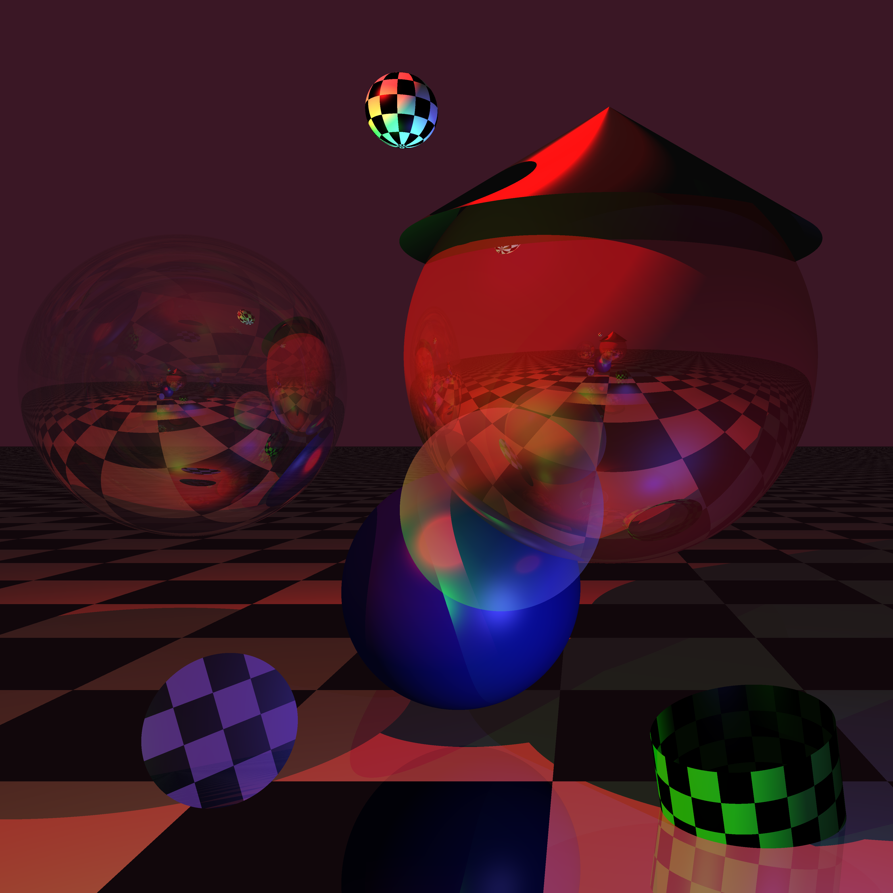

# `raytracer_ini`
Basic raytracer that reads .ini files as its input for a scene and renders them.

## Basic usage

Render the `basic_scene.ini` scene with the `basic_observer.ini` observer at a resolution of 2000x2000 in png format: 
```
./raytracer_ini -s config/basic_scene.ini -O config/basic_observer.ini -o rendered_example.png 2000
```

You'll most likely define the observer sections and the scene sections in the same file. If that is the case may specify only a scene, as is the case with `final_scene.ini`.
```
./raytracer_ini -s config/final_scene.ini -o rendered_example.png 2000
```

Pass the `--help` flag for more information.

### Supported image formats

The final image format is determined by the output file extension. The available image formats are those [supported by the image crate](https://github.com/image-rs/image#supported-image-formats).

## Example config files

- Well documented scene example: [config/basic_scene.ini](./config/basic_scene.ini) 
- Well documented observer example: [config/basic_observer.ini](./config/basic_observer.ini)

These files together produce the following image:


There's more examples in the [config/](./config) folder that aren't documented.

## Missing functionality

### Light model

- Currently transparent surfaces do create shadows but not full shadows, depending on their level of transparency the level of light that they block. But colored transparent surfaces don't alter the color of the light that passes through them, it only attenuates it.

- Speculative reflection doesn't seem to work properly on transparent surfaces (imagine the shine on a bubble)

### Cylinders

- Let cylinders have caps (https://www.cl.cam.ac.uk/teaching/1999/AGraphHCI/SMAG/node2.html#SECTION00023200000000000000)
